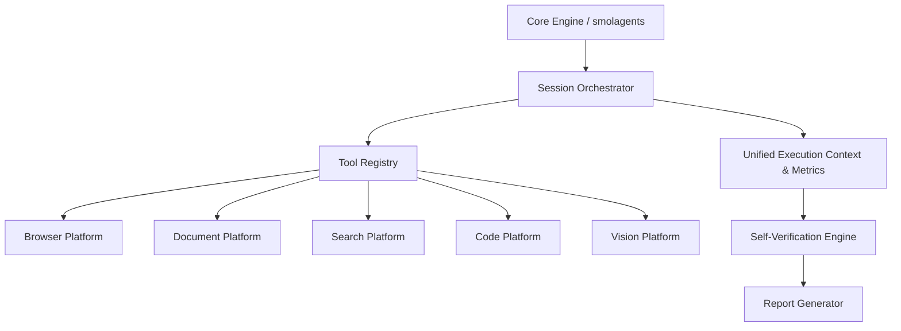

# AI Research Assistant (ARA)

A modular, production-ready AI Research Assistant built for comprehensive web research, document analysis, and benchmark execution. 

## Features

- **Local & Cloud LLM Support:** Fully integrated with `LiteLLM` and `Ollama` for flexible model deployment.
- **Robust Tool Ecosystem:** Extensible tool registry powered by `smolagents`, offering over a dozen integrated capabilities.
- **Unified Observability:** Standardized execution context tracks performance metrics, telemetry, and structured logging.
- **Self-Verification Engine:** Ensures high-confidence research results with fact-checking, citation tracking, and contradiction detection.
- **Interactive Browser Automation:** Playwright-based dynamic DOM interaction with macro support.
- **Evaluation & Benchmarking:** First-class support for GAIA and custom benchmark suites.

## Architecture

The ARA platform is built on a modular, decoupled architecture (Version 1.0 frozen).



## Setup Instructions

### Prerequisites
- Python 3.10+
- Playwright browsers installed (`playwright install`)

### Installation

1. Clone the repository and install dependencies:
   ```bash
   pip install -r requirements.txt
   playwright install
   ```

2. Configure environment variables in `.env`:
   ```bash
   GEMINI_API_KEY="your_api_key_here"
   # Or configure alternative providers via LiteLLM
   ```

3. Run the application:
   ```bash
   python main.py
   ```

## Workflow Explanation

1. **User Request:** A complex research query is provided via CLI or API.
2. **Planning:** The agent synthesizes a multi-step execution plan.
3. **Execution Context:** The `UnifiedExecutionContext` begins tracking latency and metadata.
4. **Tool Execution:** Specialized tools (e.g., `BrowserToolFacade`, `CodeTool`) perform domain-specific actions.
5. **Self-Verification:** Before outputting the final result, the `SelfVerificationEngine` evaluates claims and verifies evidence.
6. **Reporting:** A comprehensive report is generated, citing sources and providing confidence scores.

## Benchmarks & Evaluation

Run the automated evaluation suite to assess system performance and readiness:
```bash
python scripts/evaluate_v1_1.py
```
This script tests end-to-end capabilities and generates a `benchmark_report.md` with detailed metrics.