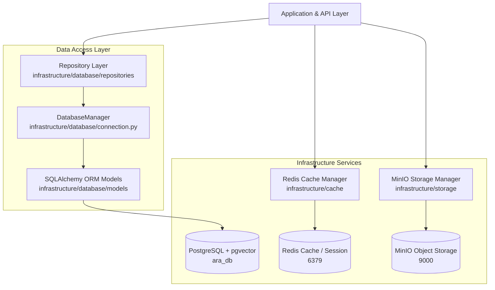

# ARA v1.0 Sprint 1 Architecture Document — Database Foundation & Infrastructure Layer

## 1. Executive Summary

Sprint 1 establishes the production-grade **Database Foundation and Infrastructure Layer** for the AI Research Assistant (ARA v1.0). It provides a scalable relational schema, `pgvector` vector embedding support, Redis multi-keyspace caching, MinIO S3-compatible object storage, repository abstractions, Alembic database migrations, database seeding, and Docker Compose orchestration.

This layer serves as the immutable data foundation for all future ARA modules (Intelligent Planner, Execution Engine, RAG Semantic Memory, Decision Intelligence, and Sprint 14 QA Evaluation Platform).

---

## 2. Architecture & Subsystem Layout

---

## 3. Component Breakdown

### 3.1 PostgreSQL Database & ORM Models (`infrastructure/database/models/`)
- **Base Mixins (`base.py`)**: `UUIDPrimaryKeyMixin` (36-char string UUID), `TimestampMixin` (created_at, updated_at), `SoftDeleteMixin` (is_deleted, deleted_at), `AuditMixin`.
- **Authentication & Access (`auth.py`)**: `User`, `Role`, `UserRole`, `APIKey`, `AuthToken`, `Session`.
- **Projects & Workspaces (`project.py`)**: `Project`, `ProjectMember`, `Workspace`.
- **Research Sessions & Messages (`research.py`)**: `ResearchSession`, `Conversation`, `Message`, `MessageAttachment`.
- **Knowledge Base & RAG (`knowledge.py`)**: `Document`, `DocumentChunk` (with `pgvector` `Vector(1536)` embedding), `DocumentMetadata`, `RetrievalStat`.
- **Reports & Artifacts (`reporting.py`)**: `Report`, `ReportSection`, `Artifact`.
- **Browser Automation (`browser.py`)**: `BrowserSession`, `BrowserActionLog`, `BrowserDownload`, `BrowserScreenshot`.
- **Workflows & Execution (`workflow.py`)**: `Workflow`, `WorkflowExecution`, `WorkflowNodeState`, `ToolExecutionLog`.
- **Connectors (`connector.py`)**: `ConnectorConfig`, `ConnectorSyncLog`.
- **Benchmarks (`benchmark.py`)**: `BenchmarkRun`, `BenchmarkTaskResult`.
- **Settings & Audit (`settings.py`)**: `SystemSetting`, `UserSetting`, `AuditLog`.

### 3.2 Repository Pattern (`infrastructure/database/repositories/`)
- **`BaseRepository[T]`**: Generic CRUD, soft-delete filtering, pagination, sorting, bulk creation.
- Specialized repositories: `UserRepository`, `ProjectRepository`, `ResearchSessionRepository`, `DocumentRepository` (vector similarity search via `vector_search()`), `WorkflowRepository`, `AuditLogRepository`.

### 3.3 Redis Caching & Session Management (`infrastructure/cache/`)
- **`RedisClientManager`**: Client pooling with fallback `InMemoryCacheFallback` for isolated test environments.
- **`CacheManager`**: Dedicated keyspaces for:
  - Key-value caching
  - User session tokens (`session:{token}`)
  - Sliding window rate limiting (`ratelimit:{user_id}`)
  - Planner DAG plans (`planner:dag:{plan_id}`)
  - Transient browser DOM state (`browser:state:{session_id}`)
  - Background workflow execution (`workflow:state:{id}`)

### 3.4 MinIO Object Storage (`infrastructure/storage/`)
- **8 Dedicated Buckets**:
  - `ara-uploads`
  - `ara-reports`
  - `ara-datasets`
  - `ara-screenshots`
  - `ara-browser-downloads`
  - `ara-browser-uploads`
  - `ara-generated-files`
  - `ara-temp-assets`
- Metadata linked in PostgreSQL; binary blobs stored in MinIO with SHA256 integrity verification and presigned GET URL generation.

### 3.5 Docker Compose Environment
- `postgres`: `pgvector/pgvector:pg16`
- `redis`: `redis:7-alpine`
- `minio`: `minio/minio` + `minio/mc` bucket auto-initializer
- Admin tools: `dpage/pgadmin4` and `redis/redisinsight`

---

## 4. Verification

- **Infrastructure Test Suite**: `tests/infrastructure/` (**6 test suites, all passing**)
- **Database Seeding**: `python -m infrastructure.database.seed` (**Verified**)
- **Full Platform Test Suite**: `pytest tests/` (**29/29 workspace tests passed**)
