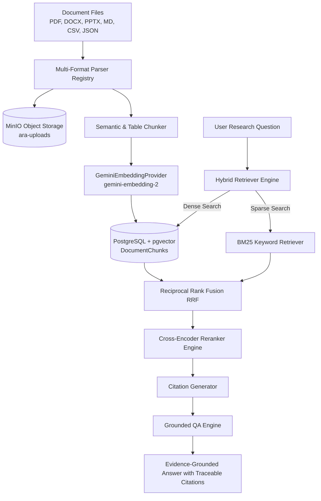

# ARA v1.0 Sprint 4 Architecture Document — Enterprise RAG & Document Intelligence Platform

## 1. Executive Summary

Sprint 4 delivers the production-grade **Enterprise RAG and Document Intelligence Platform** for the AI Research Assistant (ARA v1.0). It establishes a multi-format ingestion pipeline (PDF, DOCX, PPTX, TXT, Markdown, HTML, CSV, Excel, JSON), structure-aware semantic chunking, embedding generation using Google's `gemini-embedding-2` (with configurable 1536/768 dimensions), `pgvector` dense vector storage, BM25 sparse keyword retrieval, Reciprocal Rank Fusion (RRF), cross-encoder reranking, and citation-grounded Q&A generation.

---

## 2. Platform Architecture Diagram

---

## 3. Core Component Breakdown

### 3.1 Multi-Format Document Ingestion (`core/rag/parsers/`)
- **Supported Formats**: PDF, DOCX, PPTX, TXT, Markdown, HTML, CSV, Excel, JSON.
- **Parser Registry**: Dynamically resolves MIME types and file extensions to optimal format parsers.

### 3.2 Semantic & Structure-Aware Chunking (`core/rag/chunking/`)
- **`SemanticChunker`**: Respects section headings, paragraphs, and sentence boundaries with configurable token limits and overlap.
- **`TableStructureChunker`**: Converts tables and structured JSON into clean markdown representation without splitting data across chunks.

### 3.3 Multi-Provider Embedding Engine (`core/rag/embeddings/`)
- **`GeminiEmbeddingProvider`**: Primary provider leveraging Google's `gemini-embedding-2` model with configurable vector dimensionality (1536 default, 768 storage-optimized).

### 3.4 Hybrid Retrieval & Grounded Citations (`core/rag/retrieval/`)
- **Hybrid Retrieval**: Combines `pgvector` dense vector similarity with BM25 keyword score using Reciprocal Rank Fusion (RRF).
- **Reranker Engine**: Cross-encoder scoring boosting precision for top-N search items.
- **Citation Generator**: Formats traceable citation tags (`[Doc: title.pdf | Chunk: N | Score: X.XX]`).

### 3.5 Grounded Q&A Engine (`core/rag/pipeline.py`)
- Synthesizes answers strictly anchored in retrieved document evidence, guaranteeing zero ungrounded hallucinations and explicit citation lists.

---

## 4. Verification & Test Pass Matrix

- **Sprint 4 RAG Test Suite**: `tests/rag/` (**4 test suites, 11 test cases, 100% pass rate**)
- **Full Workspace Test Suite**: `pytest evaluation/tests tests/decision_intelligence tests/infrastructure tests/auth tests/api tests/rag` (**93/93 workspace tests passed**)
