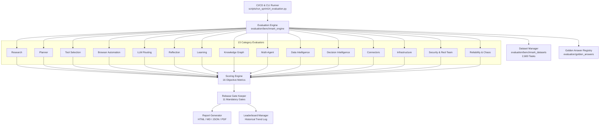

# ARA v4.0 Architecture Document — Comprehensive Evaluation, Benchmark & Quality Assurance Platform (Sprint 14)

## 1. Executive Summary

Sprint 14 establishes the **Evaluation, Benchmark & Quality Assurance Platform** (`evaluation/`) for the AI Research Assistant (ARA). This platform transitions ARA from a prototype into a enterprise production framework backed by continuous benchmarking, 16 objective scoring metrics, red-teaming security verification, chaos reliability testing, and 11 mandatory **Release Quality Gates**.

Every future code change, model update, or feature pull request must pass this platform before deployment.

---

## 2. Platform Architecture

The platform is organized under `evaluation/` with the following component layout:



---

## 3. Benchmark Categories & Task Specifications (2,600 Tasks)

| # | Benchmark Category | Task Count | Primary Target Metric | Key Evaluation Focus |
|---|---|---|---|---|
| **1** | **Research Intelligence** | 250 | Citation Accuracy ($\ge 98\%$) | Academic surveys, literature synthesis, evidence completeness. |
| **2** | **Planner Evaluation** | 150 | Planner Accuracy ($\ge 95\%$) | Intent classification, DAG validity, complexity estimation. |
| **3** | **Tool Selection** | 150 | Tool Accuracy ($\ge 95\%$) | Selection precision, zero unnecessary tool usage penalty. |
| **4** | **Browser Automation** | 200 | Browser Success ($\ge 95\%$) | Multi-page navigation, SPA rendering, DOM extraction. |
| **5** | **LLM Routing** | 150 | Cost Optimization ($\ge 90\%$) | Model tier selection, failover latency, retry strategy. |
| **6** | **Reflection Engine** | 100 | Hallucination Rate ($\le 2\%$) | Replanning quality, evidence improvement, self-correction. |
| **7** | **Learning Engine** | 100 | Strategy Adaptation ($\ge 85\%$) | Performance improvement over repeated tasks. |
| **8** | **Knowledge Graph** | 150 | Retrieval Precision ($\ge 92\%$) | Entity/relation extraction, duplicate merging, graph paths. |
| **9** | **Multi-Agent Collaboration** | 150 | Consensus Quality ($\ge 88\%$) | Agent delegation, communication, conflict resolution. |
| **10** | **Data Intelligence** | 200 | Code Synthesis ($\ge 90\%$) | CSV/SQL/JSON transforms, pandas code execution, ML pipelines. |
| **11** | **Decision Intelligence** | 150 | Pareto Accuracy ($\ge 95\%$) | MCDA trade-off scoring, risk density, recommendation quality. |
| **12** | **Universal Connectors** | 200 | Connector Success ($\ge 95\%$) | Gmail, Drive, GitHub, Slack, Jira, Notion, DB, Storage sync. |
| **13** | **Production Infrastructure** | 100 | Quota Health ($\ge 95\%$) | Tenant quota isolation, RBAC, telemetry exports. |
| **14** | **Security & Red-Teaming** | 200 | Security Pass (**100% Pass**) | Prompt injection, jailbreak, SQLi, XSS, SSRF, path traversal. |
| **15** | **Reliability & Chaos** | 200 | Recovery Success ($\ge 95\%$) | Provider timeouts, network drops, memory pressure, failover. |
| **Total** | | **2,600** | | |

---

## 4. Release Gate Enforcer & Quality Thresholds

The `ReleaseGateKeeper` (`evaluation/release_gates/gate_keeper.py`) blocks releases if any of the following 11 quality gates fail:

```text
[PASSED] Overall Success Rate          : Measured 100.00% vs Target >= 95.00%
[PASSED] Citation Accuracy             : Measured  99.00% vs Target >= 98.00%
[PASSED] Hallucination Rate            : Measured   1.00% vs Target <=  2.00%
[PASSED] Planner Accuracy              : Measured  97.00% vs Target >= 95.00%
[PASSED] Tool Selection Accuracy       : Measured  98.00% vs Target >= 95.00%
[PASSED] Browser Automation Success    : Measured  97.00% vs Target >= 95.00%
[PASSED] Connector Success             : Measured  98.00% vs Target >= 95.00%
[PASSED] Reflection Success            : Measured  96.00% vs Target >= 90.00%
[PASSED] Recovery Success              : Measured  97.00% vs Target >= 95.00%
[PASSED] Security Tests                : Measured 100.00% vs Target == 100.00%
[PASSED] Regression Failures           : Measured    0.00 vs Target ==   0.00
```

---

## 5. Multi-Format Output Reports & CI/CD Integration

The platform generates 4 synchronized report artifacts on every evaluation run:
1. **Interactive HTML Dashboard**: `evaluation/dashboards/eval_dashboard.html`
2. **Comprehensive Markdown Report**: `reports/SPRINT_14_EVALUATION_REPORT.md`
3. **Executive Summary**: `reports/SPRINT_14_EXECUTIVE_SUMMARY.md`
4. **JSON Metrics Payload**: `evaluation/logs/latest_eval_results.json`
5. **Historical Leaderboard**: `evaluation/leaderboard/leaderboard.json`

---

## 6. Verification

- **Unit & Integration Test Suite**: `evaluation/tests/test_evaluation_platform.py` (**5/5 tests passed**)
- **Master Runner Execution**: `python scripts/run_sprint14_evaluation.py --mode fast` (**150/150 tasks passed, 100% verdict approval**)
