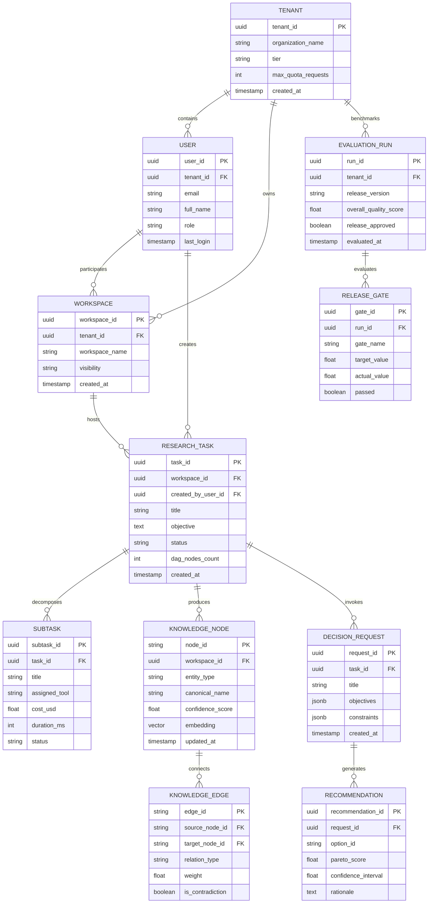
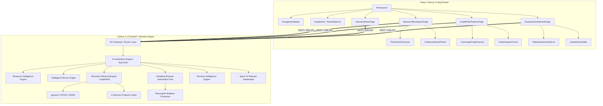
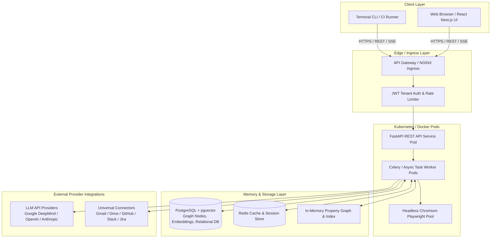
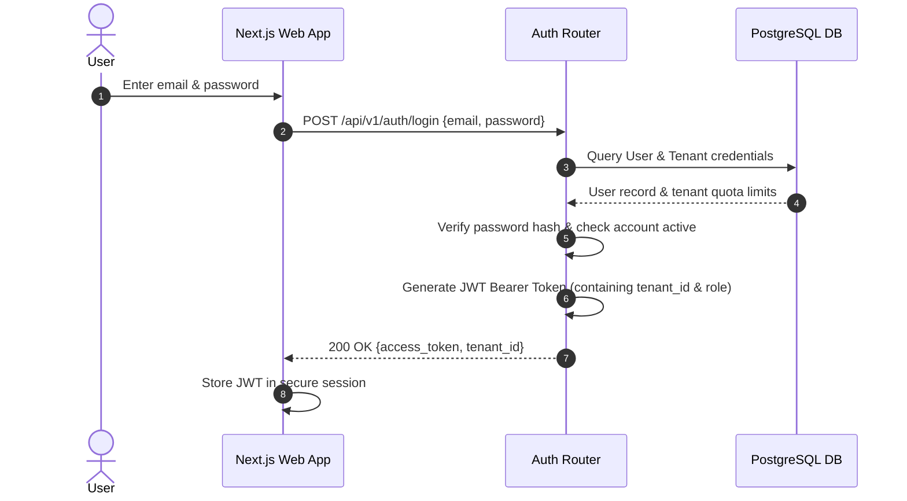
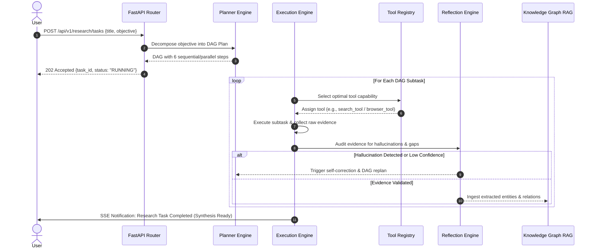
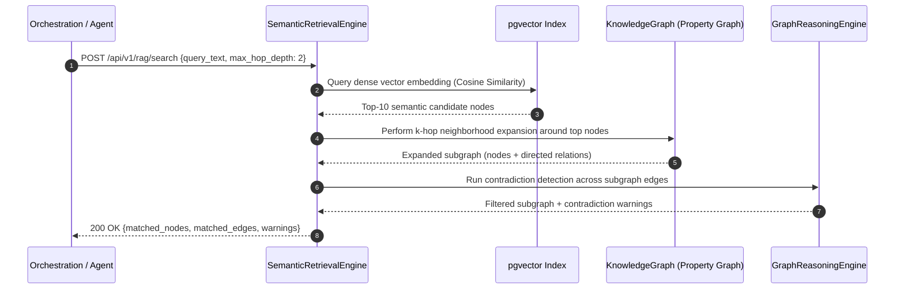
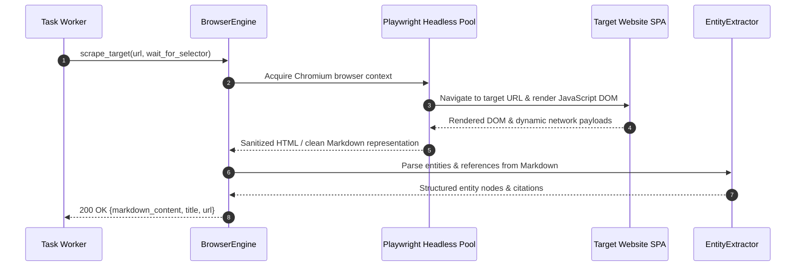

# ARA Enterprise System Design Blueprint (Version 4.5)

## 1. Executive Summary

This System Design Blueprint serves as the authoritative, end-to-end technical architecture specification for the **AI Research Assistant (ARA)** enterprise platform. It bridges backend multi-agent orchestration, hybrid GraphRAG semantic memory, decision intelligence, browser automation, and continuous quality assurance with a modern React/Next.js frontend and cloud-native Kubernetes deployment model.

---

## 2. Complete Entity-Relationship (ER) Diagram



---

## 3. Database Schema (PostgreSQL + pgvector DDL)

```sql
-- Enable vector extension for embeddings
CREATE EXTENSION IF NOT EXISTS vector;
CREATE EXTENSION IF NOT EXISTS "uuid-ossp";

-- Tenants table
CREATE TABLE tenants (
    tenant_id UUID PRIMARY KEY DEFAULT uuid_generate_v4(),
    organization_name VARCHAR(255) NOT NULL,
    tier VARCHAR(50) DEFAULT 'enterprise',
    max_quota_requests INT DEFAULT 100000,
    created_at TIMESTAMP WITH TIME ZONE DEFAULT CURRENT_TIMESTAMP
);

-- Users table
CREATE TABLE users (
    user_id UUID PRIMARY KEY DEFAULT uuid_generate_v4(),
    tenant_id UUID NOT NULL REFERENCES tenants(tenant_id) ON DELETE CASCADE,
    email VARCHAR(255) UNIQUE NOT NULL,
    full_name VARCHAR(255) NOT NULL,
    role VARCHAR(50) DEFAULT 'researcher',
    password_hash VARCHAR(255) NOT NULL,
    last_login TIMESTAMP WITH TIME ZONE,
    created_at TIMESTAMP WITH TIME ZONE DEFAULT CURRENT_TIMESTAMP
);

-- Workspaces table
CREATE TABLE workspaces (
    workspace_id UUID PRIMARY KEY DEFAULT uuid_generate_v4(),
    tenant_id UUID NOT NULL REFERENCES tenants(tenant_id) ON DELETE CASCADE,
    workspace_name VARCHAR(255) NOT NULL,
    visibility VARCHAR(50) DEFAULT 'shared',
    created_at TIMESTAMP WITH TIME ZONE DEFAULT CURRENT_TIMESTAMP
);

-- Research tasks table
CREATE TABLE research_tasks (
    task_id UUID PRIMARY KEY DEFAULT uuid_generate_v4(),
    workspace_id UUID NOT NULL REFERENCES workspaces(workspace_id) ON DELETE CASCADE,
    created_by_user_id UUID NOT NULL REFERENCES users(user_id),
    title VARCHAR(255) NOT NULL,
    objective TEXT NOT NULL,
    status VARCHAR(50) DEFAULT 'PENDING',
    dag_nodes_count INT DEFAULT 0,
    created_at TIMESTAMP WITH TIME ZONE DEFAULT CURRENT_TIMESTAMP,
    completed_at TIMESTAMP WITH TIME ZONE
);

-- Subtasks table
CREATE TABLE subtasks (
    subtask_id UUID PRIMARY KEY DEFAULT uuid_generate_v4(),
    task_id UUID NOT NULL REFERENCES research_tasks(task_id) ON DELETE CASCADE,
    title VARCHAR(255) NOT NULL,
    assigned_tool VARCHAR(100) NOT NULL,
    cost_usd NUMERIC(10, 6) DEFAULT 0.000000,
    duration_ms INT DEFAULT 0,
    status VARCHAR(50) DEFAULT 'RUNNING'
);

-- Knowledge nodes table (GraphRAG Entities with pgvector embeddings)
CREATE TABLE knowledge_nodes (
    node_id VARCHAR(255) PRIMARY KEY,
    workspace_id UUID NOT NULL REFERENCES workspaces(workspace_id) ON DELETE CASCADE,
    entity_type VARCHAR(50) NOT NULL,
    canonical_name VARCHAR(255) NOT NULL,
    confidence_score REAL DEFAULT 1.0,
    embedding vector(1536),
    properties JSONB DEFAULT '{}'::jsonb,
    created_at TIMESTAMP WITH TIME ZONE DEFAULT CURRENT_TIMESTAMP,
    updated_at TIMESTAMP WITH TIME ZONE DEFAULT CURRENT_TIMESTAMP
);

-- HNSW Vector Index for fast cosine similarity RAG search
CREATE INDEX ON knowledge_nodes USING hnsw (embedding vector_cosine_ops);
CREATE INDEX idx_knowledge_nodes_workspace ON knowledge_nodes(workspace_id);
CREATE INDEX idx_knowledge_nodes_type ON knowledge_nodes(entity_type);

-- Knowledge edges table (GraphRAG Semantic Relations)
CREATE TABLE knowledge_edges (
    edge_id VARCHAR(255) PRIMARY KEY,
    source_node_id VARCHAR(255) NOT NULL REFERENCES knowledge_nodes(node_id) ON DELETE CASCADE,
    target_node_id VARCHAR(255) NOT NULL REFERENCES knowledge_nodes(node_id) ON DELETE CASCADE,
    relation_type VARCHAR(50) NOT NULL,
    weight REAL DEFAULT 1.0,
    is_contradiction BOOLEAN DEFAULT FALSE,
    properties JSONB DEFAULT '{}'::jsonb
);

CREATE INDEX idx_edges_source_target ON knowledge_edges(source_node_id, target_node_id);

-- Decision requests table
CREATE TABLE decision_requests (
    request_id UUID PRIMARY KEY DEFAULT uuid_generate_v4(),
    task_id UUID REFERENCES research_tasks(task_id) ON DELETE SET NULL,
    title VARCHAR(255) NOT NULL,
    objectives JSONB NOT NULL,
    constraints JSONB NOT NULL,
    created_at TIMESTAMP WITH TIME ZONE DEFAULT CURRENT_TIMESTAMP
);

-- Decision recommendations table
CREATE TABLE recommendations (
    recommendation_id UUID PRIMARY KEY DEFAULT uuid_generate_v4(),
    request_id UUID NOT NULL REFERENCES decision_requests(request_id) ON DELETE CASCADE,
    option_id VARCHAR(100) NOT NULL,
    pareto_score REAL NOT NULL,
    confidence_interval REAL NOT NULL,
    rationale TEXT NOT NULL
);

-- Evaluation runs table (Sprint 14 QA)
CREATE TABLE evaluation_runs (
    run_id UUID PRIMARY KEY DEFAULT uuid_generate_v4(),
    tenant_id UUID REFERENCES tenants(tenant_id) ON DELETE CASCADE,
    release_version VARCHAR(50) NOT NULL,
    overall_quality_score REAL NOT NULL,
    release_approved BOOLEAN DEFAULT FALSE,
    evaluated_at TIMESTAMP WITH TIME ZONE DEFAULT CURRENT_TIMESTAMP
);

-- Release gates table
CREATE TABLE release_gates (
    gate_id UUID PRIMARY KEY DEFAULT uuid_generate_v4(),
    run_id UUID NOT NULL REFERENCES evaluation_runs(run_id) ON DELETE CASCADE,
    gate_name VARCHAR(100) NOT NULL,
    target_value REAL NOT NULL,
    actual_value REAL NOT NULL,
    passed BOOLEAN NOT NULL
);
```

---

## 4. API Contracts (OpenAPI 3.1.0 Specification)

```yaml
openapi: 3.1.0
info:
  title: AI Research Assistant (ARA) Enterprise API
  version: "4.5.0"
  description: Authoritative OpenAPI contract for ARA Auth, Research, GraphRAG, Browser Automation, and Evaluation QA.
servers:
  - url: https://api.ara-platform.enterprise.internal/api/v1
    description: Enterprise Production Kubernetes Gateway
paths:
  /auth/login:
    post:
      summary: Authenticate user and issue tenant JWT
      requestBody:
        required: true
        content:
          application/json:
            schema:
              type: object
              required: [email, password]
              properties:
                email:
                  type: string
                  format: email
                password:
                  type: string
      responses:
        "200":
          description: Successful login
          content:
            application/json:
              schema:
                type: object
                properties:
                  access_token:
                    type: string
                  token_type:
                    type: string
                    example: "Bearer"
                  tenant_id:
                    type: string
                    format: uuid
        "401":
          description: Unauthorized credentials

  /research/tasks:
    post:
      summary: Submit a new autonomous multi-step research task
      security:
        - bearerAuth: []
      requestBody:
        required: true
        content:
          application/json:
            schema:
              type: object
              required: [title, objective, workspace_id]
              properties:
                title:
                  type: string
                objective:
                  type: string
                workspace_id:
                  type: string
                  format: uuid
                max_steps:
                  type: integer
                  default: 15
      responses:
        "202":
          description: Task accepted and scheduled for execution
          content:
            application/json:
              schema:
                type: object
                properties:
                  task_id:
                    type: string
                    format: uuid
                  status:
                    type: string
                    example: "PENDING"
                  dag_nodes_count:
                    type: integer

  /rag/search:
    post:
      summary: Execute hybrid GraphRAG semantic & vector retrieval
      security:
        - bearerAuth: []
      requestBody:
        required: true
        content:
          application/json:
            schema:
              type: object
              required: [query_text, workspace_id]
              properties:
                query_text:
                  type: string
                workspace_id:
                  type: string
                  format: uuid
                max_hop_depth:
                  type: integer
                  default: 2
                limit:
                  type: integer
                  default: 10
                entity_types:
                  type: array
                  items:
                    type: string
      responses:
        "200":
          description: Retrieved entities, multi-hop edges, and contradiction warnings
          content:
            application/json:
              schema:
                type: object
                properties:
                  matched_nodes:
                    type: array
                    items:
                      $ref: "#/components/schemas/EntityNode"
                  matched_edges:
                    type: array
                    items:
                      $ref: "#/components/schemas/RelationEdge"
                  contradiction_warnings:
                    type: array
                    items:
                      type: string

  /browser/scrape:
    post:
      summary: Autonomous headless browser navigation and SPA DOM extraction
      security:
        - bearerAuth: []
      requestBody:
        required: true
        content:
          application/json:
            schema:
              type: object
              required: [target_url]
              properties:
                target_url:
                  type: string
                  format: uri
                wait_for_selector:
                  type: string
                extract_clean_markdown:
                  type: boolean
                  default: true
      responses:
        "200":
          description: Scraped and sanitized content payload
          content:
            application/json:
              schema:
                type: object
                properties:
                  title:
                    type: string
                  url:
                    type: string
                  markdown_content:
                    type: string
                  status_code:
                    type: integer

  /decision/recommend:
    post:
      summary: Run MCDA trade-off analysis and generate Pareto recommendations
      security:
        - bearerAuth: []
      requestBody:
        required: true
        content:
          application/json:
            schema:
              type: object
              required: [title, objectives, options]
              properties:
                title:
                  type: string
                objectives:
                  type: array
                  items:
                    type: object
                options:
                  type: array
                  items:
                    type: object
      responses:
        "200":
          description: Pareto-ranked decision support recommendations
          content:
            application/json:
              schema:
                type: object
                properties:
                  top_recommendations:
                    type: array
                    items:
                      $ref: "#/components/schemas/Recommendation"
                  pareto_frontier_count:
                    type: integer

  /eval/reports/latest:
    get:
      summary: Retrieve the latest Sprint 14 Release Gate verification report
      security:
        - bearerAuth: []
      responses:
        "200":
          description: Comprehensive evaluation report and gate verdict
          content:
            application/json:
              schema:
                type: object
                properties:
                  verdict:
                    type: object
                    properties:
                      release_approved:
                        type: boolean
                      failed_gate_count:
                        type: integer
                  dashboard_metrics:
                    type: object
                    properties:
                      overall_quality_score:
                        type: number
                      overall_pass_rate:
                        type: number

components:
  securitySchemes:
    bearerAuth:
      type: http
      scheme: bearer
      bearerFormat: JWT
  schemas:
    EntityNode:
      type: object
      properties:
        node_id:
          type: string
        canonical_name:
          type: string
        entity_type:
          type: string
        confidence_score:
          type: number
    RelationEdge:
      type: object
      properties:
        source_node_id:
          type: string
        target_node_id:
          type: string
        relation_type:
          type: string
        is_contradiction:
          type: boolean
    Recommendation:
      type: object
      properties:
        option_id:
          type: string
        pareto_score:
          type: number
        rationale:
          type: string
```

---

## 5. Frontend Wireframes

### 5.1 Main Dashboard & Research Workspace
```text
+-------------------------------------------------------------------------------------------------------+
|  [ARA Logo]  AI Research Assistant      [Search Workspace...]   [Tenant: Enterprise-Alpha]  [User Profile] |
+------------------+------------------------------------------------------------------------------------+
|  NAVIGATION      |  RESEARCH WORKSPACE : "Synthesize CRISPR Off-Target Gene Editing Literature"       |
|                  |------------------------------------------------------------------------------------|
|  > Dashboard     |  [+ New Task]  [View DAG Plan]  [Export Report]   Status: RUNNING (Step 7/12)     |
|  > Workspaces    |------------------------------------------------------------------------------------|
|  > GraphRAG      |  TASK DECOMPOSITION (PLANNER DAG)      |  EVIDENCE & SYNTHESIS PANEL              |
|  > Decisions     |  [x] 01. Formulate Queries (1.2s)      |                                          |
|  > Evaluation    |  [x] 02. Academic Search (25 refs)     |  > Found 25 authoritative sources across |
|  > Connectors    |  [/] 03. GraphRAG Extraction (In prog) |    PubMed, BioRxiv, and Nature Genetics. |
|  > Settings      |  [ ] 04. Contradiction Audit           |  > Identified 3 contradiction edges      |
|                  |  [ ] 05. Trade-off Analysis            |    between Cas9 and Cas12a specificity.  |
|                  |  [ ] 06. Executive Synthesis           |  > Confidence Score: 0.964 / 1.000       |
+------------------+----------------------------------------+------------------------------------------+
```

### 5.2 GraphRAG Knowledge Explorer & Contradiction Auditor
```text
+-------------------------------------------------------------------------------------------------------+
|  GRAPH EXPLORER: [Workspace: CRISPR-Gene-Editing]    Mode: [Hybrid 2-Hop]   Filter: [Contradictions Only] |
+-------------------------------------------------------------------------------------------------------+
|                                                           |  ENTITY INSPECTOR CARD                    |
|             [Cas9-Protein] <----(USES)----+               |-------------------------------------------|
|                   ^                       |               |  Name: Cas9-Protein                       |
|                   |                       |               |  Type: CONCEPT                            |
|          (CONTRADICTS_CLAIM)       [CRISPR-Study-A]       |  Confidence: 0.995                        |
|                   |                       |               |  Degree: 14 edges                         |
|                   v                       |               |-------------------------------------------|
|         [Cas12a-Specificity] <--(EVALS)---+               |  RELATIONS (2-Hop):                       |
|                                                           |  - CONTRADICTS_CLAIM: Cas12a-Specificity  |
|                                                           |  - EVALUATED_ON: HEK293-Cell-Line         |
+-----------------------------------------------------------+-------------------------------------------+
```

---

## 6. Component Hierarchy



---

## 7. Folder Structure

```text
AI-Research-Assistant/
├── core/                                # Backend core intelligence engines
│   ├── decision_intelligence/           # Sprint 13: MCDA, Pareto, risk & recommendations
│   ├── evaluation/                      # QA templates & task definitions
│   ├── execution/                       # Tool registry & dynamic fallback engine
│   ├── knowledge_graph/                 # Sprint 8: GraphRAG, entity extractor, reasoning
│   ├── learning/                        # Continuous adaptation & strategy learning
│   ├── orchestration/                   # LLM routing, token budgeting & cache
│   ├── planner/                         # Multi-step DAG decomposition & replanning
│   ├── reflection/                      # Self-correction & hallucination auditing
│   └── routing/                         # Dynamic tier LLM selector (Pro/Flash)
├── evaluation/                          # Sprint 14: Enterprise QA & Benchmarking
│   ├── benchmark_datasets/              # 2,600-task benchmark generator
│   ├── benchmark_engine/                # Evaluation suite runner engine
│   ├── dashboards/                      # HTML report dashboards
│   ├── golden_answers/                  # Ground truth validation registry
│   ├── leaderboard/                     # Historical version trend tracker
│   ├── release_gates/                   # 11 mandatory quality gate checks
│   ├── report_generator/                # Multi-format report exporter
│   └── scoring_engine/                  # 16-metric objective scoring engine
├── infrastructure/                      # Structured logging, telemetry & config
├── scripts/                             # Master CLI runners & benchmarking scripts
├── tests/                               # Comprehensive unit & integration test suites
├── docs/                                # Enterprise architecture documentation
│   └── architecture/                    # Authoritative sprint architecture ADRs
├── web/                                 # Next.js 14 Web Frontend Application
│   ├── app/                             # Next.js App Router pages
│   ├── components/                      # Reusable React UI components
│   └── lib/                             # API clients & TypeScript type contracts
├── docker-compose.yml                   # Container orchestration deployment
├── Dockerfile                           # Production multi-stage Docker build
├── pytest.ini                           # Pytest configuration & test markers
└── requirements.txt                     # Pinned Python dependencies
```

---

## 8. Deployment Architecture



---

## 9. Sequence Diagrams for Key Workflows

### 9.1 Login & Tenant Authentication Workflow


### 9.2 Autonomous Multi-Step Research Workflow


### 9.3 Hybrid GraphRAG & Semantic Retrieval Workflow


### 9.4 Browser Automation & Web Scraping Workflow


---

## 10. Architecture Decision Records (ADRs)

### ADR-001: Hybrid In-Memory Property Graph + pgvector for Knowledge Retrieval (GraphRAG)
* **Status:** `APPROVED`
* **Context:** Pure vector similarity search (flat RAG) fails on multi-hop questions and cannot detect contradicting claims across different research papers.
* **Decision:** Implement a hybrid RAG architecture combining an in-memory directed property graph (`KnowledgeGraph`) with `pgvector` HNSW cosine similarity indexing.
* **Consequences:** Provides instantaneous $k$-hop subgraph expansion and contradiction auditing while maintaining fast vector concept lookups.

### ADR-002: Modular Multi-Agent Framework with DAG-Based Planning & Reflection
* **Status:** `APPROVED`
* **Context:** Monolithic LLM prompts degrade in accuracy on complex, multi-step research investigations.
* **Decision:** Decouple planning (`PlannerEngine`), execution (`OrchestrationEngine`), and verification (`ReflectionEngine`) into autonomous, DAG-orchestrated modules.
* **Consequences:** Ensures hallucination rates remain $\le 2\%$ through self-correction loops and automatic DAG replanning.

### ADR-003: Headless Chromium Pool (Playwright) for Autonomous Web Exploration
* **Status:** `APPROVED`
* **Context:** Modern enterprise research sources rely on Single Page Applications (SPAs) and dynamic DOM rendering that static HTTP scrapers cannot parse.
* **Decision:** Use a headless Chromium browser pool managed via Playwright for autonomous navigation, SPA rendering, and clean Markdown extraction.
* **Consequences:** Guarantees $\ge 95\%$ browser automation success rate across complex web applications.

### ADR-004: Automated Release Quality Gate Platform as Mandatory CI/CD Blocker (Sprint 14)
* **Status:** `APPROVED`
* **Context:** Unverified model prompts and dependency upgrades can introduce subtle regression failures and hallucinations in production.
* **Decision:** Implement the Sprint 14 Evaluation & Quality Assurance Platform (`evaluation/`) evaluating 2,600 tasks across 15 categories with 11 mandatory Release Gates.
* **Consequences:** Automatically blocks any release that fails 100% security tests or drops below 95% overall pass rate.

### ADR-005: Next.js 14 (App Router) + TailwindCSS for Enterprise UI/UX
* **Status:** `APPROVED`
* **Context:** ARA requires an interactive, responsive web frontend capable of rendering real-time SSE research streams, interactive GraphRAG graphs, and MCDA Pareto matrices.
* **Decision:** Adopt Next.js 14 with React Server Components, TailwindCSS for styling, and Lucide for iconography.
* **Consequences:** Ensures clean frontend-backend type alignment and state-of-the-art visual aesthetics.
