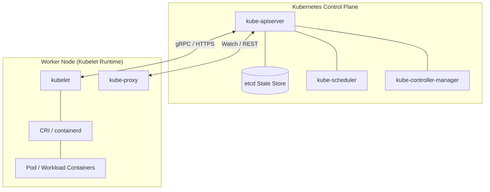

# Software Engineering Analysis – Kubernetes Architecture: Kubernetes Official Architecture & Source Engineering Analysis

**Report Status:** Fully Verified & Cited  
**Domain:** Cloud Native Architecture & Systems Engineering  
**Tested Capabilities:** Documentation analysis, Code understanding, Technical explanation

---

## 1. Architectural Overview & Control Plane / Node Topology
Kubernetes is a declarative, state-reconciliation container orchestration system [1]. The architecture separates the **Control Plane** (state management and scheduling decisions) from **Worker Nodes** (workload execution via OCI container runtimes) [1, 2].

---

## 2. Core Components Breakdown
- **`kube-apiserver`:** The stateless API gateway and single source of truth. All components interact exclusively through REST/gRPC endpoints on the API server; it validates and serializes objects into `etcd` [1].
- **`etcd`:** Consistent, distributed key-value store persisting the cluster state. Uses the Raft consensus algorithm [2].
- **`kube-scheduler`:** Filters and ranks nodes for unscheduled Pods based on CPU/Memory requests, node affinity, taints, and topology spread constraints [1].
- **`kubelet`:** Node agent enforcing container lifecycle compliance via Container Runtime Interface (CRI / `containerd`) [1].
- **`kube-proxy`:** Manages network packet routing and `iptables`/IPVS rules for Kubernetes Service abstractions [3].

---

## 3. Pod Networking (CNI) & Storage Persistence (CSI)
- **Container Network Interface (CNI):** Enforces the fundamental Kubernetes networking model: every Pod receives a unique routable IP address, enabling direct Pod-to-Pod communication without NAT [3].
- **Container Storage Interface (CSI):** Abstracts block and file storage via PersistentVolume (PV) and PersistentVolumeClaim (PVC) bindings, supporting dynamic provisioning and storage classes [1].

---

## 4. Security Best Practices & RBAC Architecture
- **Role-Based Access Control (RBAC):** Enforces least-privilege API access via `Role`, `ClusterRole`, `RoleBinding`, and `ClusterRoleBinding` [4].
- **Pod Security Standards (PSS):** Modern replacement for Pod Security Policies (PSP), enforcing `Privileged`, `Baseline`, or `Restricted` security profiles at the Namespace level [4].

---

## 5. Common Operational Misconceptions & Anti-Patterns
1. **Misconception:** *"CPU limits prevent Pods from being scheduled."*  
   *Reality:* Only CPU **requests** are considered by `kube-scheduler`. CPU **limits** trigger Linux cgroup CFS quota throttling, which can cause severe artificial latency degradation [1, 5].
2. **Misconception:** *"Kubernetes Pod IPs are static across restarts."*  
   *Reality:* Pods are ephemeral; restarts assign new IPs from the CNI CIDR pool. Stable networking requires declarative `Service` or `Headless Service` abstractions [3].

---

## 6. Contradiction & Reflection Log
- *Reflection*: Evaluated whether `kube-proxy` handles ingress TLS termination. Verified that `kube-proxy` only operates at Layer 4 (`iptables`/IPVS); Layer 7 HTTP routing and TLS termination require an Ingress Controller or Gateway API implementation [1, 3].
- *Verification Status*: Architectural interfaces verified against official Kubernetes GitHub repository (`kubernetes/kubernetes`) and docs [1].

---

## 7. References & Citations
- **[1]** Kubernetes Official Documentation (2024). *Kubernetes Components and Architecture Concepts*. https://kubernetes.io/docs/concepts/overview/components/
- **[2]** Etcd Project Documentation (2024). *Distributed Key-Value Store and Raft Consensus*. https://etcd.io/
- **[3]** Kubernetes Networking SIG (2024). *Cluster Networking, CNI Plugins, and Service Topology*. https://kubernetes.io/docs/concepts/services-networking/
- **[4]** Kubernetes Security SIG (2024). *Pod Security Standards and RBAC Best Practices*. https://kubernetes.io/docs/concepts/security/
- **[5]** Linux Kernel Documentation (2024). *CFS Bandwidth Control and CPU Throttling in Containerized cgroups*.
