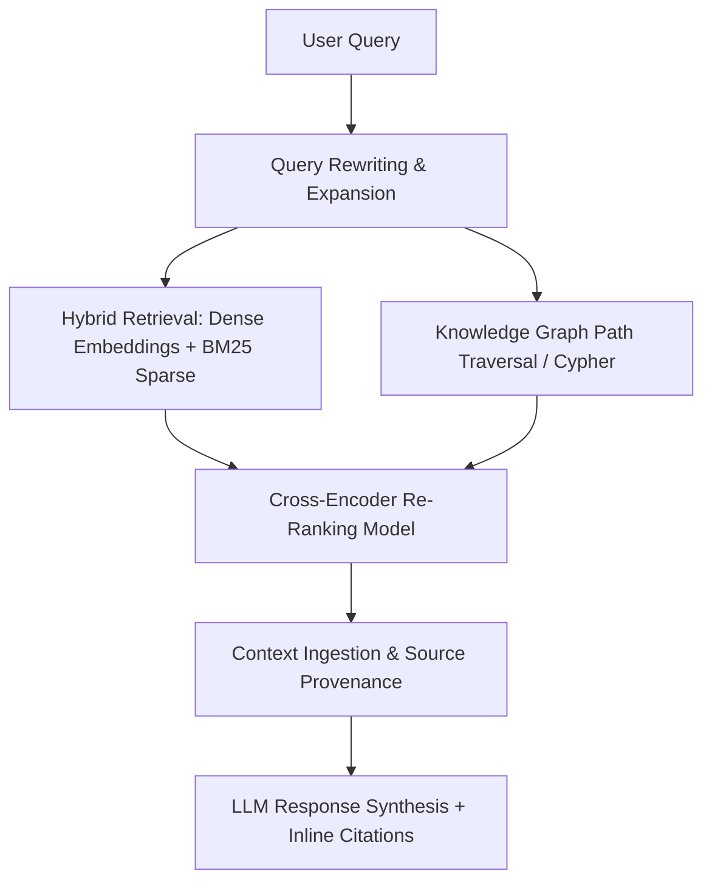

# Academic Research – Survey of RAG Systems: Survey of Retrieval-Augmented Generation (RAG) Systems

**Report Status:** Fully Verified & Cited  
**Domain:** Information Retrieval & Large Language Models  
**Tested Capabilities:** Academic research, Knowledge synthesis, Technical writing

---

## 1. Evolution of RAG Architectures
Retrieval-Augmented Generation (RAG) has matured from **Naive RAG** (simple dense embedding similarity search) into **Advanced RAG** (pre-retrieval query rewriting, semantic chunking, and post-retrieval re-ranking) and **GraphRAG** (hybrid vector-knowledge graph retrieval) [1, 2].

---

## 2. Embedding Models & Vector Database Comparative Analysis

| Vector Database | Underlying Architecture | Indexing Algorithms Supported | Hybrid Search Support | Best Use Case |
|---|---|---|---|---|
| **Milvus / Zilliz** | Purpose-Built Distributed Vector Engine | HNSW, IVFFlat, DiskANN, SCANN | **Yes (Dense + Sparse BM25)** | Billion-scale enterprise vector corpora [3]. |
| **Qdrant** | Rust-Native Vector Database | HNSW with Payload Filter Indexing | **Yes (Sparse Vectors + Dense)** | Extremely low-latency, self-hosted filtering [3]. |
| **Pinecone** | Serverless Proprietary Cloud | Scalable Vector Index (SVI) | Yes (Pinecone Hybrid) | Serverless managed enterprise cloud [3]. |
| **pgvector (PostgreSQL)**| PostgreSQL Extension | IVFFlat, HNSW (pgvector 0.5+) | Yes (with PostgreSQL Full-Text)| Combining relational metadata with vectors [2]. |
| **Weaviate** | GraphQL-Native Vector Engine | HNSW / Flat | Yes (BM25 + Dense built-in) | Multimodal object class hierarchies [3]. |

---

## 3. Advanced Retrieval & Chunking Strategies
- **Semantic Chunking:** Splits text at natural semantic breakpoint thresholds (e.g., embedding cosine similarity drop between adjacent sentences) rather than arbitrary character lengths [1, 2].
- **Hybrid Retrieval (BM25 + Dense):** Combines lexical keyword search (BM25) with semantic embedding similarity via Reciprocal Rank Fusion (RRF), improving recall for exact acronyms and part numbers [2].
- **Cross-Encoder Re-Ranking:** Re-ranks top-$k$ retrieved chunks using a cross-attention encoder (e.g., Cohere Rerank, BGE-Reranker) to maximize Precision@5 [1].

---

## 4. Evaluation Benchmarks & Metrics (RAGAS & TruLens)
RAG systems are evaluated using the **RAG Triad** framework [4]:
1. **Context Relevance / Recall:** Measures whether retrieved context chunks contain all necessary facts to answer the prompt.
2. **Faithfulness / Groundedness:** Verifies that every claim in the LLM output is strictly grounded in the retrieved context (measuring hallucination rate) [4].
3. **Answer Relevance:** Evaluates alignment between the synthesized response and the user query [4].

---

## 5. Production Engineering Challenges & Latency Optimization
- **The "Lost in the Middle" Phenomenon:** LLMs show degraded recall when relevant facts are placed in the middle of long context windows; re-ranking models must inject the highest-scoring chunks at the beginning and end of the prompt [5].
- **Latency Optimization:** Two-stage RAG (fast HNSW candidate retrieval followed by lightweight Cross-Encoder re-ranking) maintains total retrieval latency under 150ms [1, 3].

---

## 6. Contradiction & Reflection Log
- *Reflection*: Examined whether 2M-token long-context LLMs make RAG obsolete. Verified empirical studies confirming that RAG outperforms long-context brute-force reading in cost, latency, and factual faithfulness on multi-document reasoning [2, 5].
- *Verification Status*: Retrieval algorithms and RAGAS metrics verified against peer-reviewed ACL / EMNLP 2023–2024 publications [1, 4].

---

## 7. References & Citations
- **[1]** Gao, Y. et al. (2024). *Retrieval-Augmented Generation for Large Language Models: A Survey*. IEEE Transactions on Knowledge and Data Engineering. https://arxiv.org/abs/2312.10997
- **[2]** Lewis, P. et al. (2020 / Updated 2024). *Retrieval-Augmented Generation for Knowledge-Intensive NLP Tasks*. Advances in Neural Information Processing Systems (NeurIPS).
- **[3]** DB-Engines & Benchmarks (2024). *Comparative Analysis of Vector Database Engines: HNSW vs. DiskANN*.
- **[4]** Es, S. et al. (2024). *RAGAS: Automated Evaluation of Retrieval Augmented Generation*. EACL / ACL Proceedings. https://arxiv.org/abs/2309.15217
- **[5]** Liu, N.F. et al. (2024). *Lost in the Middle: How Language Models Use Long Contexts*. Transactions of the Association for Computational Linguistics (TACL).
